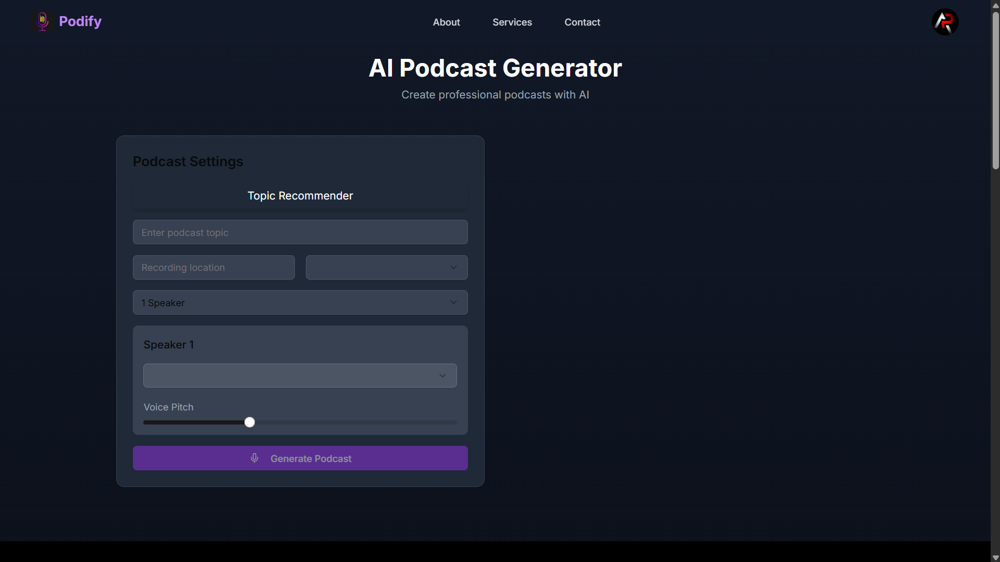
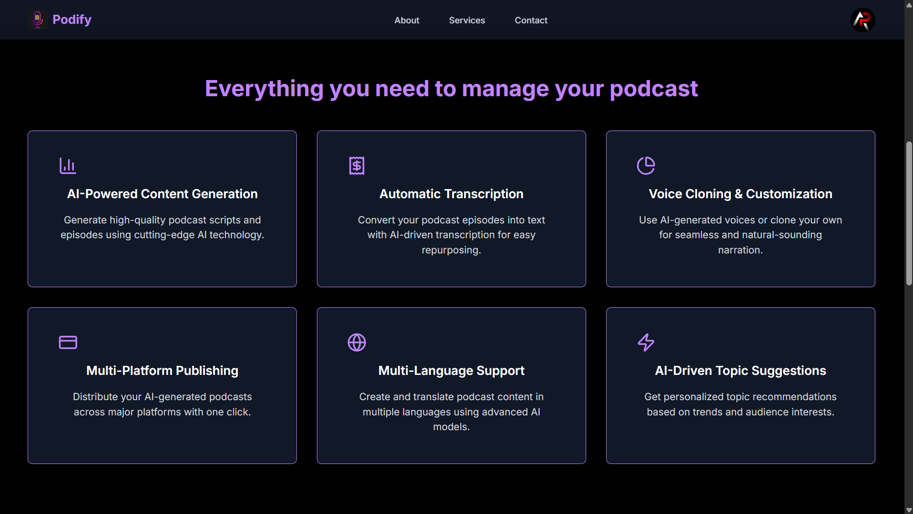
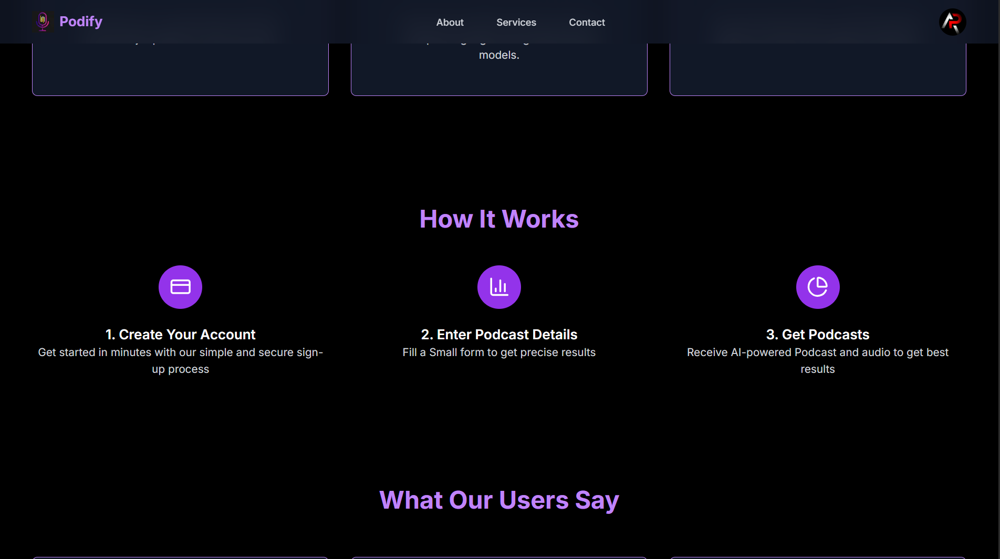

# Podify-AI: Personalized Podcast Generator Using Generative AI

## Project Overview
Podify-AI is a full-stack web application that leverages state-of-the-art Generative AI to create personalized podcast episodes for users. By combining advanced language models and neural text-to-speech, the system generates high-quality, engaging, and contextually relevant podcasts in real time. Users can customize topics, emotions, voices, and more, resulting in a unique listening experience tailored to their preferences.

---

## Features
- **AI-Generated Podcast Scripts:** Automatically generate podcast scripts based on user input (topic, emotion, location, etc.) using large language models.
- **Text-to-Speech Audio Synthesis:** Convert scripts into natural-sounding audio with customizable voices, pitch, and emotion.
- **Topic Recommendation:** Suggest trending or relevant podcast topics using AI-based recommendation.
- **Multi-Speaker Support:** Simulate conversations with multiple speakers, each with unique voice and emotion settings.
- **Modern UI:** Responsive, user-friendly interface built with Next.js and Tailwind CSS.
- **Authentication & Protected Routes:** Secure user authentication using Clerk.

---

## Tech Stack
- **Frontend:** Next.js, React, TypeScript, Tailwind CSS
- **Backend:** Python (Flask)
- **AI/ML:**
	- Large Language Models (e.g., GPT, Gemini, Llama)
	- Neural Text-to-Speech (e.g., Tacotron, FastSpeech, or commercial APIs)
- **Authentication:** Clerk
- **Other:** REST APIs, Custom UI Components

---

## Generative AI Techniques Used
- **Natural Language Generation (NLG):** Large language models (e.g., GPT, Gemini, Llama) for script writing.
- **Text-to-Speech (TTS) Synthesis:** Neural TTS models for generating podcast audio with customizable voices.
- **Topic Recommendation:** Embedding-based similarity search or LLM-based suggestion for relevant topics.
- **Voice Customization:** Deep learning models for voice selection, pitch, and emotion control in audio output.

---

## How the Project Works
1. **User Input:** Users enter a podcast topic, select emotion, location, number of speakers, and customize voice settings.
2. **Script Generation:** The backend uses a large language model to generate a podcast script based on the input.
3. **Audio Generation:** The script is converted to audio using neural TTS, with user-selected voice and emotion.
4. **Playback & Download:** Users can listen to or download the generated podcast episode directly from the web app.
5. **Topic Recommendation:** Users can get AI-powered suggestions for podcast topics.

---

## How to Run This Project

### 1. Clone the Repository
```sh
git clone <repo-url>
cd Hacksync_Error101
```

### 2. Install Frontend Dependencies
```sh
cd podcast
npm install
```

### 3. Install Backend Dependencies
```sh
cd ../backend
pip install -r requirements.txt
```

### 4. Start the Backend Server
```sh
python app.py
```
This will start the Flask server (usually at http://127.0.0.1:5000).

### 5. Start the Frontend (Next.js) Server
Open a new terminal, then:
```sh
cd podcast
npm run dev
```
This will start the Next.js app (usually at http://localhost:3000).

### 6. Open the App
Visit `http://localhost:3000` in your browser.

---

## Notes
- Make sure your backend `.env` and API keys are set up for the language model and TTS services you use.
- MongoDB is included in the backend for potential storage of scripts/audio, but is not required for basic generation features.
- For any issues, check the backend and frontend logs for error messages.